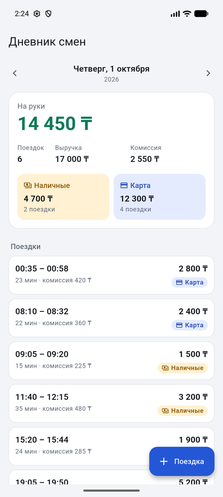
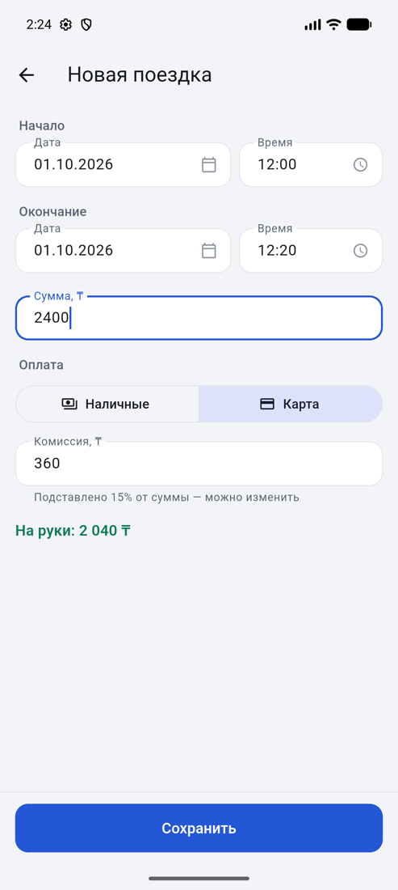
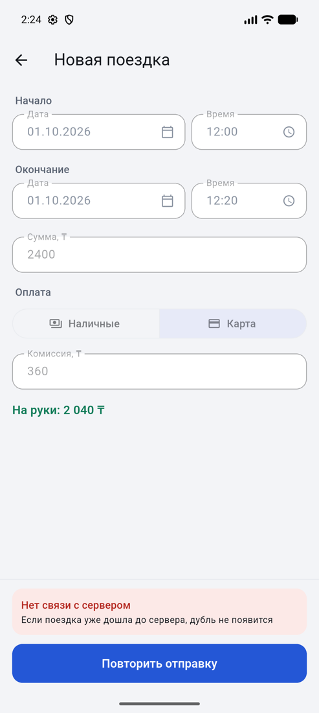
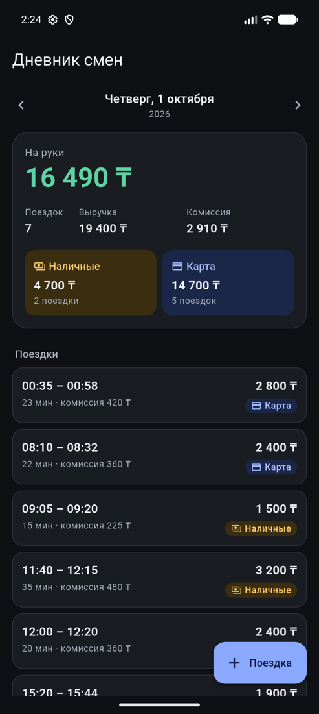

# Дневник смен водителя

Сервер на Python (FastAPI) отдаёт поездки водителя и сводку за день. Мобильное приложение на
Flutter показывает их, переключает дни и добавляет новые поездки. Повторная отправка той же
поездки дубля не создаёт — в том числе после обрыва связи и при одновременных запросах.

<p>
  
  
  
  
</p>

## Демо

- **Приложение:** [APK в последнем релизе](https://github.com/dumantoleu01/driver-shift-diary/releases/latest).
  Ставится на Android и сразу работает с сервером ниже.
- **Сервер:** <https://shift-diary.onrender.com/docs> — запросы можно пробовать прямо из браузера.

Сервер стоит на бесплатном тарифе Render. Без запросов он засыпает и на первый запрос отвечает до
минуты — приложение в это время показывает пояснение. При перезапуске сервера база возвращается к
образцу, добавленные поездки пропадают. APK подписан отладочным ключом: для демонстрации этого
достаточно, для магазина приложений — нет.

## Что сделано

| Требование задания | Где в коде | Чем проверено |
|---|---|---|
| API отдаёт поездки за день и сводку: число поездок, выручка, комиссия, «на руки», наличные/карта | `server/shift_diary/api.py`, `domain/summary.py`, `domain/day.py` | `server/tests/test_summary.py`, `test_day.py`, `test_api.py` |
| Клиент показывает сводку и список, переключает дни | `app/lib/features/shifts/presentation/` | `app/test/day_cubit_test.dart`, `day_page_test.dart` |
| Добавление поездки с проверкой: сумма > 0, окончание позже начала | `server/shift_diary/payload.py`, `domain/rules.py`; форма — `trip_form_cubit.dart`, `domain/rules/trip_rules.dart` | `server/tests/test_rules.py`, `test_api.py`; `app/test/trip_rules_test.dart`, `trip_form_cubit_test.dart` |
| Повторная отправка не создаёт дубль | `server/shift_diary/storage.py`; клиент — `trip_form_cubit.dart` | `server/tests/test_storage.py`, `test_api.py`; `app/test/trip_form_cubit_test.dart`, `trip_form_page_test.dart` |
| Тесты на расчёт сводки и на защиту от дублей | — | 177 тестов сервера, 113 тестов приложения |

## Запуск

**Сервер** — одной командой, без установки Python:

```bash
docker compose up --build
```

Или без Docker (нужен только [uv](https://docs.astral.sh/uv/), Python 3.13 он поставит сам):

```bash
cd server && uv run uvicorn shift_diary.main:app --host 0.0.0.0
```

Сервер поднимается на `http://localhost:8000` с образцом данных из `data/trips.json`: 27 поездок
с 29 сентября по 4 октября 2026 года. На странице `http://localhost:8000/docs` запросы можно
пробовать из браузера: кнопка «Execute» у `POST /api/trips` дважды — и видно `201`, затем `200`.

**Приложение** (Flutter 3.38, запущенный эмулятор Android или симулятор iOS — проверено на обоих):

```bash
cd app && flutter run
```

Адрес сервера задаётся при сборке: `--dart-define=API_BASE_URL=https://…`. Без него приложение
идёт на сервер той же машины: `10.0.2.2:8000` с эмулятора Android, `127.0.0.1:8000` с симулятора
iOS.

**Проверки:**

```bash
make check       # сервер: ruff, mypy (строгий режим), pytest
make app-check   # приложение: flutter analyze, flutter test
```

## API

| Запрос | Ответ |
|---|---|
| `GET /api/days` | дни, в которых есть поездки, и пояс сервиса |
| `GET /api/days/{ГГГГ-ММ-ДД}` | сводка и поездки за день одним ответом |
| `POST /api/trips` | `201` — создана, `200` — такая уже есть, `409` — `id` занят другой поездкой, `422` — ошибки по полям |

Сводка за день:

```bash
curl http://localhost:8000/api/days/2026-10-01
```

```json
{
  "date": "2026-10-01",
  "summary": {
    "trips": 6, "revenue": 17000, "commission": 2550, "net": 14450,
    "by_payment": {"cash": {"trips": 2, "amount": 4700}, "card": {"trips": 4, "amount": 12300}}
  },
  "trips": [{"id": "t14", "start": "2026-10-01T00:35:00+05:00", "…": "…"}]
}
```

Добавление и повтор:

```bash
TRIP='{"id":"demo-1","start":"2026-10-05T08:10:00+05:00","end":"2026-10-05T08:32:00+05:00","amount":2400,"payment":"card","commission":360}'

curl -i -X POST localhost:8000/api/trips -H 'Content-Type: application/json' -d "$TRIP"   # 201 Created
curl -i -X POST localhost:8000/api/trips -H 'Content-Type: application/json' -d "$TRIP"   # 200 OK, та же запись
```

Отказ — всегда в одном формате, с кодом на каждое негодное поле:

```json
{"error": {"code": "validation_failed", "message": "…",
           "fields": {"start": "offset_required", "amount": "invalid_type", "payment": "invalid_value"}}}
```

## Решения

**День считается в поясе сервиса.** Пояс — фиксированное смещение из настроек сервера (по
умолчанию `+05:00`), а не UTC и не часы машины. Поездка в 00:35 1 октября по UTC ещё вчерашняя;
при наивной группировке она попала бы не в тот день. Имя пояса (`Asia/Almaty`) не используется:
Алматы перешёл на UTC+5 в марте 2024 года, и со старой базой поясов имя даёт `+06:00`. Тесты
сервера и приложения проходят при поясах машины UTC, UTC−7 и UTC+14.

**Поездка относится к дню своего начала**, даже если закончилась после полуночи: её сумма
считается один раз.

**Пояс сервиса приложение получает с сервера**, а не из настроек телефона. В коде приложения нет
ни одного `toLocal()`.

**Деньги — целые числа.** Сервер не приводит молча `"2400"`, `2400.0` и `true` к числу, форма не
округляет «2400,50» — это ошибка под полем.

**«Та же поездка»** определяется двумя способами, и оба закреплены ограничениями уникальности в
базе:

- тот же `id` — клиент повторил запрос;
- те же начало, конец, сумма, оплата и комиссия — тот же JSON пришёл с другим `id` или без него.
  Один водитель не может вести две поездки в одну и ту же секунду.

Вставка идёт одним запросом `INSERT … ON CONFLICT DO NOTHING`. Проверка «есть ли такая» перед
вставкой не годится: запросы обрабатываются в потоках. Контрольный опыт с такой проверкой на той
же нагрузке (20 одновременных отправок) в девяти прогонах из десяти оставил от 2 до 10 записей
вместо одной.

**Обрыв связи.** Приложение назначает `id` поездки один раз, при открытии формы. Если отправка
оборвалась, неизвестно, записана ли поездка, поэтому форма блокирует поля и оставляет только
повтор той же отправки. Исправленная поездка стала бы второй, если первая всё-таки дошла. Пока
идёт отправка, форму нельзя закрыть; если её закрыли после обрыва, главный экран открывает день
этой поездки и просит свериться со списком, прежде чем вводить её заново.

**Сводку считает только сервер** и отдаёт её вместе со списком одним ответом — итог не может
разойтись с поездками на экране.

**Проверки сверх задания:** время только строкой ISO 8601 со смещением; оплата только `cash` или
`card`; комиссия от 0 до суммы; поездка не дольше суток; сумма не больше 100 000 000; даты с 2000
по 2099 год. Ограничение длительности ловит опечатку в дате: записанную поездку нечем исправить.
Последние два нужны, чтобы негодные данные получали `422`, а не роняли сервер.

## Границы

Не сделано намеренно: авторизация и несколько водителей, редактирование и удаление поездок,
офлайн-очередь, проверка пересечения разных поездок по времени.

## Устройство

```
data/trips.json          образец поездок
server/shift_diary/
  domain/                поездка, границы дня, сводка, правила — без FastAPI и базы
  payload.py             разбор входных данных
  storage.py             SQLite и защита от дублей
  seed.py                загрузка образца — тем же путём, что и запросы
  api.py                 маршруты и формат ошибок
app/lib/
  core/                  пояс сервиса, сеть, ошибки, тема, роутер, DI
  features/shifts/
    domain/              сущности, правила формы, контракт репозитория
    data/                разбор ответов и запросы
    presentation/        кубиты, экран дня, форма поездки
```

Приложение: Cubit, get_it, dio, dartz, go_router. В состоянии экрана лежит код ошибки, текст
подставляется при показе; текст исключения до водителя не доходит.

## Автопроверки

GitHub Actions на каждый пуш:

- сервер — ruff, mypy, pytest;
- образ сервера собирается, запускается и отвечает на запрос;
- приложение — формат, анализатор, тесты и релизный APK артефактом.

По тегу `v*` APK собирается с адресом боевого сервера и прикладывается к релизу. Правила для
ИИ-агентов (Claude Code, Codex) лежат в `AGENTS.md`: команды, соглашения и инварианты, которые
нельзя ломать.

## Как использовался ИИ

Код написан в Claude Code по схеме «анализ → план → реализация по этапам»: каждый этап
заканчивался прогоном тестов и линтеров и отдельным коммитом. Готовый код прошёл два независимых
ревью: отдельным агентом Claude без доступа к ходу работы и Codex. Первое нашло семь дефектов,
второе — два, и оба совпали с находками первого.

**Ошибки ИИ, пойманные по ходу работы**

| Что произошло | Как поймано | Что сделано |
|---|---|---|
| Предложил сервер на Dart и хранение в JSON-файле с защитой от дублей в памяти процесса | Сверка с вакансией: стек команды — Flutter и Python | Сервер на Python; защита от дублей перенесена в ограничения базы, потому что защита в памяти не работает между потоками и процессами |
| Форма, заблокированная после обрыва связи, оставалась заблокированной и после отказа сервера: ошибка под полем есть, а исправить её нельзя | Повторное чтение кода до запуска | Определённый ответ сервера снимает блокировку; на это есть тест |
| Тесты экрана формы, написанные ИИ, упали | Прогон тестов | Сбой вскрыл настоящий дефект: после ошибки кнопка «Повторить» уезжала за край экрана. Кнопка закреплена внизу |
| На заблокированной форме пропадал выбранный способ оплаты и оставалась подсказка «можно изменить» | Запуск на эмуляторе и просмотр снимка экрана | Исправлено |
| `switch` по типам ошибок сети не знал нового значения из свежей версии библиотеки | Анализатор | Добавлено |
| Взял тестовый HTTP-клиент по памяти, а фреймворк уже требует другой пакет | Предупреждение при запуске | Заменён |
| Указал тег действия CI по аналогии с другими (`setup-uv@v10`), а такого тега нет | Первый прогон CI упал на подготовке | Указана точная версия |

**Дефекты, найденные независимыми ревью**

| Дефект | Кто нашёл | Что сделано |
|---|---|---|
| «Назад» во время отправки: поездка записывалась, а экран показывал день без неё — водитель ввёл бы её второй раз | Claude, воспроизведено тестом | Форма не закрывается, пока идёт отправка; после обрыва главный экран открывает день поездки |
| Ответа приложение ждало 30 секунд, а сервер на бесплатном хостинге просыпается до минуты | Claude | Ожидание 75 секунд и пояснение на экране загрузки |
| Поездку на краю допустимых дат можно было записать, а её день открыть нельзя | Claude и Codex независимо | Диапазон дней шире диапазона поездок на сутки |
| Календарь не открывался для дня далеко от сегодняшнего и отмечал «сегодня» по часам телефона | Claude и Codex независимо; отметку «сегодня» — Claude | Границы календаря совпадают с границами сервера, «сегодня» берётся в поясе сервиса |
| Перенос начала поездки оставлял окончание на прежней дате — получалась поездка на двое суток | Claude | Окончание сдвигается вслед за началом; поездка дольше суток не принимается ни формой, ни сервером |
| Файл с образцом, сохранённый с меткой BOM, останавливал запуск сервера | Claude | Файл читается в обоих вариантах |
| Утверждение «релизная сборка ходит только по HTTPS» и настройки под него в манифестах | Claude усомнился; проверено на эмуляторе: релизный APK ходит и по HTTP | Лишние настройки убраны |

**Что проверялось отдельно, потому что на слово верить было нельзя**

- **Тест на гонку.** То, что тест проходит, ещё не значит, что он что-то ловит. Та же нагрузка
  была запущена против наивной версии «проверил — вставил» — и в девяти прогонах из десяти дала
  дубли.
- **Тесты клиента.** Защита от устаревших ответов, блокировка формы, двойное нажатие, запрет
  закрытия во время отправки и сдвиг окончания по очереди убирались из кода — соответствующий
  тест каждый раз падал.
- **Шаблон Flutter.** Разрешение на доступ в сеть шаблон даёт только отладочной сборке. Релизный
  APK без него собран и запущен на эмуляторе: приложение показывает «Нет связи с сервером», до
  сервера не доходит ни один запрос. С разрешением — доходит.
- **Пояс машины.** Тесты сервера и приложения прогнаны при поясах UTC, UTC−7 и UTC+14; CI идёт в
  UTC, разработка — в UTC+5.
- **Чистый клон.** Тесты, анализатор и сборка образа проходят из свежего клона репозитория.
